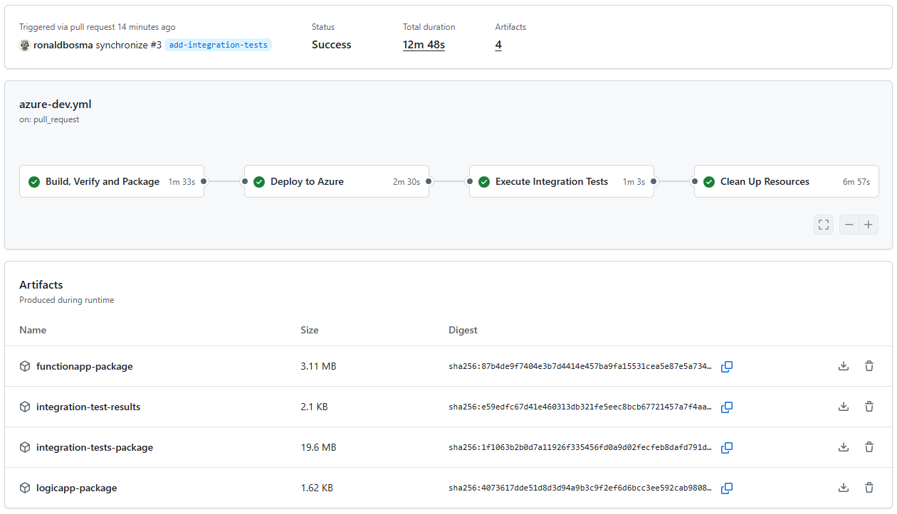

# Call API Management with Managed Identity

An Azure Developer CLI (`azd`) template using Bicep that demonstrates how to call Azure API Management (APIM) from Azure Functions and Logic Apps using managed identity authentication with OAuth. It also shows how one APIM API can securely call another APIM API using its managed identity, enabling secret-free, secure authentication between Azure services.

## Overview

This template deploys the following resources:


- **Azure API Management** service with two APIs:
  - **Protected API**: A backend API that's protected with OAuth
  - **Unprotected API**: A public API that calls the protected API using the system-assigned managed identity of API Management

- **Azure Function App**: A .NET 9 function that calls the protected API using the system-assigned managed identity of the Function App

- **Azure Logic App (Standard)**: A workflow that calls the protected API using the system-assigned managed identity of the Logic App

- **Supporting resources**: Application Insights, Log Analytics workspace, Storage Account, and Entra ID app registrations

The template demonstrates how to authenticate between Azure services using managed identities instead of client secrets or certificates. This approach provides better security and eliminates the need to manage and rotate secrets.

> [!NOTE]
> If you can't use a managed identity, have a look at [Call API Management backend with OAuth](https://github.com/ronaldbosma/call-apim-backend-with-oauth) instead.

> [!IMPORTANT]  
> This template is not production-ready; it uses minimal cost SKUs and omits network isolation, advanced security, governance and resiliency. Harden security, implement enterprise controls and/or replace modules with [Azure Verified Modules](https://azure.github.io/Azure-Verified-Modules/) before any production use.


## Getting Started

### Prerequisites  

Before you can deploy this template, make sure you have the following tools installed and the necessary permissions:

**Required Tools:**
- [Azure Developer CLI (azd)](https://learn.microsoft.com/en-us/azure/developer/azure-developer-cli/install-azd)  
  Installing `azd` also installs the following tools:  
  - [GitHub CLI](https://cli.github.com)  
  - [Bicep CLI](https://learn.microsoft.com/en-us/azure/azure-resource-manager/bicep/install)  
- [.NET Core 9 SDK](https://dotnet.microsoft.com/en-us/download/dotnet/9.0)  
- [npm CLI](https://nodejs.org/) 
  _(This template uses a workaround to deploy the Logic App workflow, which requires the npm CLI.)_
- This template includes several hooks that run at different stages of the deployment process and require the following tools. For more details, see [Hooks](#hooks).
  - [PowerShell](https://learn.microsoft.com/en-us/powershell/scripting/install/installing-powershell)
  - [Azure CLI](https://learn.microsoft.com/en-us/cli/azure/install-azure-cli?view=azure-cli-latest)

**Required Permissions:**
- You need **Owner** or **Contributor** permissions on an Azure Subscription to deploy this template
- You need **Application Administrator** or **Cloud Application Administrator** permissions to register the Entra ID app registrations 
  _(You already have enough permissions if 'Users can register applications' is enabled in your Entra tenant.)_

### Deployment

Once the prerequisites are installed on your machine, you can deploy this template using the following steps:

1. Run the `azd init` command in an empty directory with the `--template` parameter to clone this template into the current directory.  

    ```cmd
    azd init --template ronaldbosma/call-apim-with-managed-identity
    ```

    When prompted, specify the name of the environment (for example, `managedidentity`). The maximum length is 32 characters.

1. Run the `azd auth login` command to authenticate to your Azure subscription using the **Azure Developer CLI** _(if you haven't already)_.

    ```cmd
    azd auth login
    ```

1. Run the `az login` command to authenticate to your Azure subscription using the **Azure CLI** _(if you haven't already)_. This is required for the [hooks](#hooks) to function properly. Make sure to log into the same tenant as the Azure Developer CLI.

    ```cmd
    az login
    ```

1. Run the `azd up` command to provision the resources in your Azure subscription and Entra ID tenant. This deployment typically takes around 7 minutes to complete. _(Use `azd provision` to only deploy the infrastructure.)_

    ```cmd
    azd up
    ```

    See [Troubleshooting](#troubleshooting) if you encounter any issues during deployment.

1. Once the deployment is complete, you can locally modify the application or infrastructure and run `azd up` again to update the resources in Azure.

### Demo and Test

The [Demo Guide](demos/demo.md) provides a step-by-step walkthrough on how to test and demonstrate the deployed resources.

### Clean up

Once you're done and want to clean up, run the `azd down` command. By including the `--purge` parameter, you ensure that the API Management service doesn't remain in a soft-deleted state, which could block future deployments of the same environment.

```cmd
azd down --purge
```


## Contents

The repository consists of the following files and directories:

```
├── .github                    
│   └── workflows              [ GitHub Actions workflow(s) ]
├── demos                      [ Demo guide(s) ]
├── hooks                      [ AZD Hooks to execute at different stages of the deployment process ]
├── images                     [ Images used in the README and demo guide ]
├── infra                      [ Infrastructure As Code files ]
│   ├── functions              [ Bicep user-defined functions ]
│   ├── modules                
│   │   ├── application        [ Protected and unprotected APIs ]
│   │   ├── entra-id           [ Modules for all Entra ID resources ]
│   │   └── services           [ Modules for all Azure services ]
│   │   └── shared             [ Shared modules ]
│   ├── types                  [ Bicep user-defined types ]
│   ├── main.bicep             [ Main infrastructure file ]
│   └── main.parameters.json   [ Parameters file ]
├── src                        
│   ├── functionApp            [ Azure Function that calls the protected API ]
│   └── logicApp               [ Logic App workflow that calls the protected API ]
├── tests                      
│   ├── IntegrationTests       [ Integration tests for automatically verifying different scenarios ]
│   └── *.http                 [ HTTP request files for testing different scenarios ]
├── azure.yaml                 [ Describes the apps and types of Azure resources ]
└── bicepconfig.json           [ Bicep configuration file ]
```


## Hooks

This template has several hooks that are executed at different stages of the deployment process. The following hooks are included:

### Pre-down hooks

These PowerShell scripts are executed before the resources are removed.

- [predown-remove-app-registrations.ps1](hooks/predown-remove-app-registrations.ps1): 
  Removes the app registrations created during the deployment process, because `azd` doesn't support deleting Entra ID resources yet. 
  See the related GitHub issue: https://github.com/Azure/azure-dev/issues/4724. 
  The Entra ID resources have a custom tag "azd-env-id: <environment-id>", so we can find and delete them.
  
- [predown-remove-law.ps1](hooks/predown-remove-law.ps1): 
  Permanently deletes all Log Analytics workspaces in the resource group to prevent issues with future deployments.
  Sometimes the requests and traces don't show up in Application Insights & Log Analytics when removing and deploying the template multiple times.


## Pipeline

This template includes a GitHub Actions workflow that automates the build, deployment and cleanup process. The workflow is defined in [azure-dev.yml](.github/workflows/azure-dev.yml) and provides a complete CI/CD pipeline for this template using the Azure Developer CLI.



The pipeline consists of the following jobs:

- **Build, Verify and Package**: This job sets up the build environment, performs Bicep linting and packages the Function App, Logic App and integration tests.
- **Deploy to Azure**: This job provisions the Azure infrastructure and deploys the packaged applications to the created resources.
- **Execute Integration Tests**: This job runs automated [integration tests](#integration-tests) on the deployed resources to verify correct functionality.
- **Clean Up Resources**: This job removes all deployed Azure resources.  

  By default, cleanup runs automatically after the deployment. This can be disabled via an input parameter when the workflow is triggered manually.

  

### Setting Up the Pipeline

To set up the pipeline in your own repository, run the following command:

```cmd
azd pipeline config
```

Follow the instructions and choose **Federated Service Principal (SP + OIDC)**, as OpenID Connect (OIDC) is the authentication method used by the pipeline, and only a **service principal** can be granted the necessary permissions in Entra ID.

After the service principal has been created:
- Add the Microsoft Graph permissions **Application.ReadWrite.All**, **AppRoleAssignment.ReadWrite.All** and **DelegatedPermissionGrant.ReadWrite.All** to the app registration of the service principal, and grant admin consent for these permissions. These permissions are necessary to deploy the Entra ID resources with the Microsoft Graph Bicep Extension.
- Assign the service principal either the **Application Administrator** or **Cloud Application Administrator** role. One of these roles is necessary for the [hooks](#hooks) to successfully remove the Entra ID resources during cleanup.

For detailed guidance, refer to:
- [Explore Azure Developer CLI support for CI/CD pipelines](https://learn.microsoft.com/en-us/azure/developer/azure-developer-cli/configure-devops-pipeline)
- [Create a GitHub Actions CI/CD pipeline using the Azure Developer CLI](https://learn.microsoft.com/en-us/azure/developer/azure-developer-cli/pipeline-github-actions)

> [!TIP]
> By default, `AZURE_CLIENT_ID`, `AZURE_TENANT_ID` and `AZURE_SUBSCRIPTION_ID` are created as variables when running `azd pipeline config`. However, [Microsoft recommends](https://learn.microsoft.com/en-us/azure/developer/github/connect-from-azure-openid-connect) using secrets for these values to avoid exposing them in logs. The workflow supports both approaches, so you can manually create secrets and remove the variables if desired.

> [!NOTE]
> The environment name in the `AZURE_ENV_NAME` variable is suffixed with `-pr{id}` for pull requests. This prevents conflicts when multiple PRs are open and avoids accidental removal of environments, because the environment name tag is used when removing resources.


## Integration Tests

The project includes integration tests built with **.NET 9** that validate various scenarios through the deployed Azure services. The tests implement the same scenarios described in the [Demo](./demos/demo.md) and are located in [IntegrationTests](tests/IntegrationTests).

Some things to note about the integration tests:
- The tests automatically locate your azd environment's `.env` file if available, to retrieve necessary configuration. In the [pipeline](#pipeline) they rely on environment variables set in the workflow.
- The [Logic App integration tests](./tests/IntegrationTests/LogicAppTests.cs) use [Azure.ResourceManager.AppService](https://learn.microsoft.com/en-us/dotnet/api/azure.resourcemanager.appservice?view=azure-dotnet) to retrieve the Logic App workflow callback URL, leveraging Azure CLI or Azure Developer CLI authentication.
- The [Pipeline integration tests](./tests/IntegrationTests/PipelineCredentialsTests.cs) use Azure CLI or Azure Developer CLI credentials to call the OAuth-protected API directly.

> [!NOTE]
> When running the integration tests, only the **Azure CLI** credentials worked for me. The **Azure Developer CLI** credentials were only successful when configured to use Azure CLI credentials by executing `azd config set auth.useAzCliAuth "true"`.


## Troubleshooting

### API Management deployment failed because the service already exists in soft-deleted state

If you've previously deployed this template and deleted the resources, you may encounter the following error when redeploying the template. This error occurs because the API Management service is in a soft-deleted state and needs to be purged before you can create a new service with the same name.

```json
{
    "code": "DeploymentFailed",
    "target": "/subscriptions/00000000-0000-0000-0000-000000000000/resourceGroups/rg-managedidentity-nwe-i2jdr/providers/Microsoft.Resources/deployments/apiManagement",
    "message": "At least one resource deployment operation failed. Please list deployment operations for details. Please see https://aka.ms/arm-deployment-operations for usage details.",
    "details": [
        {
            "code": "ServiceAlreadyExistsInSoftDeletedState",
            "message": "Api service apim-managedidentity-nwe-i2jdr was soft-deleted. In order to create the new service with the same name, you have to either undelete the service or purge it. See https://aka.ms/apimsoftdelete."
        }
    ]
}
```

Use the [az apim deletedservice list](https://learn.microsoft.com/en-us/cli/azure/apim/deletedservice?view=azure-cli-latest#az-apim-deletedservice-list) Azure CLI command to list all deleted API Management services in your subscription. Locate the service that is in a soft-deleted state and purge it using the [purge](https://learn.microsoft.com/en-us/cli/azure/apim/deletedservice?view=azure-cli-latest#az-apim-deletedservice-purge) command. See the following example:

```cmd
az apim deletedservice purge --location "swedencentral" --service-name "apim-managedidentity-nwe-i2jdr"
```

### Function App deployment failed because of quota limitations

If you already have a Consumption tier (`SKU=Y1`) Function App deployed in the same region, you may encounter the following error when deploying the template. This error occurs because you have reached the region's quota for your subscription.

```json
{
  "code": "InvalidTemplateDeployment",
  "message": "The template deployment 'functionApp' is not valid according to the validation procedure. The tracking id is '00000000-0000-0000-0000-000000000000'. See inner errors for details.",
  "details": [
    {
      "code": "ValidationForResourceFailed",
      "message": "Validation failed for a resource. Check 'Error.Details[0]' for more information.",
      "details": [
        {
          "code": "SubscriptionIsOverQuotaForSku",
          "message": "This region has quota of 1 instances for your subscription. Try selecting different region or SKU."
        }
      ]
    }
  ]
}
```

Use the `azd down --purge` command to delete the resources, then deploy the template in a different region.

### Logic App deployment failed because of quota limitations

If you already have a Workflow Standard WS1 tier (`SKU=WS1`) Logic App deployed in the same region, you may encounter the following error when deploying the template. This error occurs because you have reached the region's quota for your subscription.

```json
{
  "code": "InvalidTemplateDeployment",
  "message": "The template deployment 'logicApp' is not valid according to the validation procedure. The tracking id is '00000000-0000-0000-0000-000000000000'. See inner errors for details.",
  "details": [
    {
      "code": "ValidationForResourceFailed",
      "message": "Validation failed for a resource. Check 'Error.Details[0]' for more information.",
      "details": [
        {
          "code": "SubscriptionIsOverQuotaForSku",
          "message": "This region has quota of 1 instances for your subscription. Try selecting different region or SKU."
        }
      ]
    }
  ]
}
```

Use the `azd down --purge` command to delete the resources, then deploy the template in a different region.
